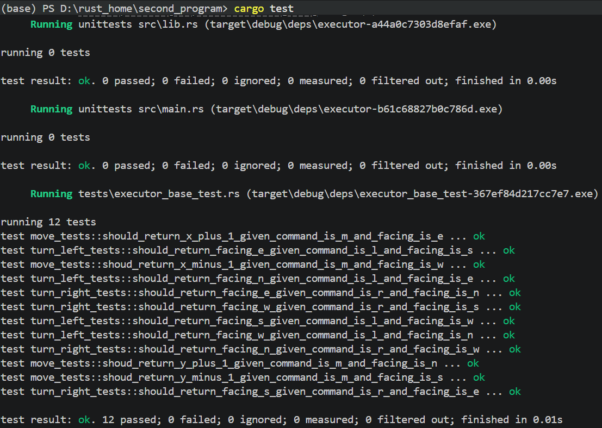
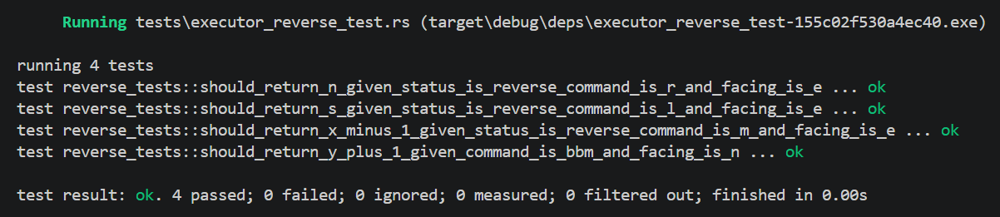
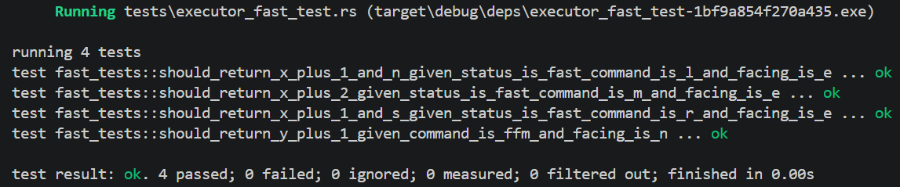
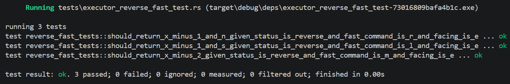
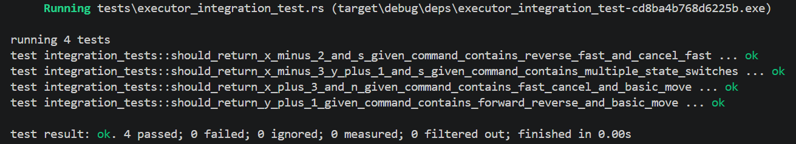

[](https://classroom.github.com/a/5pSShGos)

# 实验二：自动驾驶车辆执行器的升级与优化

| 实践日期：2026-5-5 | 实践课程：Rust 编程语言 |
| --- | --- |
| 学号：10235101495 | 姓名：李贤达 |

本实验在实验一 `Executor` 车辆执行器的基础上继续扩展。实验一只支持基础控制指令 `M/L/R`，实验二进一步加入 `B` 倒车状态和 `F` 加速状态，并通过模块化拆分和任务编排的方式降低代码的圈复杂度。

本项目的核心思想是`Executor` 不直接在 `execute` 中堆叠大量业务判断，而是把复杂命令拆成一组可复用的原子动作 `Action`，再逐个作用到 `Pose` 上。

## 1. 实验目标

1. 保留基础控制指令：
   - `M`：沿当前朝向前进一格
   - `L`：左转 90 度，位置不变
   - `R`：右转 90 度，位置不变
2. 支持倒车指令 `B`：
   - 第一次收到 `B` 后进入倒车状态
   - 倒车状态下 `M` 表示后退一格
   - 倒车状态下 `L` 表示右转
   - 倒车状态下 `R` 表示左转
   - 再次收到 `B` 后取消倒车状态
3. 支持加速指令 `F`：
   - 第一次收到 `F` 后进入加速状态
   - 加速状态下 `M` 表示前进两格
   - 加速状态下 `L` 表示先前进一格，再左转
   - 加速状态下 `R` 表示先前进一格，再右转
   - 再次收到 `F` 后取消加速状态
4. 支持 `B` 和 `F` 状态叠加：
   - `BFM`：倒退两格
   - `BFL`：先倒退一格，再右转
   - `BFR`：先倒退一格，再左转
5. 通过 `Pose`、`State`、`Action`、`Executor` 分层实现模块化。
## 2. 项目结构

```text
second_program/
├── Cargo.toml
├── Cargo.lock
├── README.md
├── 实验2-模块化与任务编排.pptx
└── executor/
    ├── Cargo.toml
    ├── src/
    │   ├── main.rs          # crate 入口，实现在命令行输入指令并输出车辆位置
    │   ├── lib.rs          # crate 模块声明与对外导出
    │   ├── executor.rs     # 执行器入口，负责接收命令并执行动作序列
    │   ├── pose.rs         # 车辆位置与朝向，封装基础移动和转向
    │   ├── state.rs        # 状态保存与任务编排
    │   └── action.rs       # 原子动作定义与执行
    └── tests/
        ├── executor_base_test.rs          # 基础 M/L/R 测试
        ├── executor_reverse_test.rs       # B 倒车状态测试
        ├── executor_fast_test.rs          # F 加速状态测试
        ├── executor_reverse_fast_test.rs  # B 和 F 叠加状态测试
        └── executor_integration_test.rs   # 多命令综合测试
```

## 3. 模块职责

### 3.1 Pose

`Pose` 描述车辆当前状态：

```rust
pub struct Pose {
    pub x: i32,
    pub y: i32,
    pub heading: char,
}
```

其中：

- `x` 表示东西方向坐标，向东为正，向西为负
- `y` 表示南北方向坐标，向北为正，向南为负
- `heading` 表示朝向，取值为 `E/S/W/N`

`Pose` 内部封装基础动作：

- `forward(offset)`：按照当前朝向移动，`offset` 为正表示前进，为负表示后退
- `turn_left()`：左转 90 度
- `turn_right()`：右转 90 度

这些基础动作在代码中使用 `pub(crate)` 修饰：

```rust
pub(crate) fn forward(&mut self, offset: i32)
```

`pub(crate)` 表示该方法只在当前 `executor` crate 内部公开。也就是说，`action.rs`、`state.rs`、`executor.rs` 等同一个 crate 内的模块可以调用它，但外部调用者不能直接调用它。

这样设计是为了封装内部细节，保证所有移动行为都经过 `State` 的状态判断和 `Action` 的任务编排。

### 3.2 Action

`Action` 是任务编排后的原子动作：

```rust
enum Action {
    Forward(i32),
    TurnLeft,
    TurnRight,
}
```

复杂指令不会直接修改坐标，而是先转换成 `Action` 序列。例如：

| 输入状态与命令 | 生成的动作序列 |
| --- | --- |
| 普通 `M` | `Forward(1)` |
| 倒车 `BM` | `Forward(-1)` |
| 加速 `FM` | `Forward(1), Forward(1)` |
| 加速 `FL` | `Forward(1), TurnLeft` |
| 倒车加速 `BFM` | `Forward(-1), Forward(-1)` |
| 倒车加速 `BFL` | `Forward(-1), TurnRight` |

### 3.3 State

`State` 保存两个可叠加状态：

```rust
struct State {
    is_reverse: bool,
    is_fast: bool,
}
```

它负责：

- `be_reverse()`：切换倒车状态
- `be_fast()`：切换加速状态
- `assemble(cmd)`：根据当前状态和 `M/L/R` 指令生成动作序列

从而实现生成指令的过程与指令实际执行分离的设计。

### 3.4 Executor

`Executor` 是对外使用的执行器：

```rust
pub struct Executor {
    pose: Pose,
    state: State,
}
```

它提供：

- `Executor::new(pose)`：指定初始位置和朝向
- `execute(&mut self, cmds: &str)`：执行一串指令
- `query(&self) -> Pose`：查询当前车辆状态
- `Default for Executor`：默认位置和朝向

## 4. 执行流程

以 `executor.execute("BFL")` 为例：

1. 读取 `B`，`State` 切换为倒车状态
2. 读取 `F`，`State` 切换为加速状态
3. 读取 `L`，当前是倒车和加速叠加状态
4. `State::assemble('L')` 生成动作序列：`Forward(-1), TurnRight`
5. 然后，`Executor` 依次执行这些 `Action`
6. `Action` 调用 `Pose` 的基础动作修改车辆状态

## 5. 圈复杂度问题的解决

本项目通过任务编排把复杂的控制问题拆开：

1. `Executor::execute` 只做命令分发：
   - `B` 调用 `state.be_reverse()`
   - `F` 调用 `state.be_fast()`
   - `M/L/R` 交给 `state.assemble(cmd)`
2. `State::assemble` 只负责根据当前状态生成动作序列：
   - 普通 `M` 生成 `Forward(1)`
   - 倒车 `M` 生成 `Forward(-1)`
   - 加速 `M` 生成 `Forward(1), Forward(1)`
   - 倒车加速 `L` 生成 `Forward(-1), TurnRight`
3. `Action::perform` 只负责把一个原子动作真正作用到 `Pose`
4. `Pose` 只负责坐标和朝向的最小变化

这样 `Executor::execute` 中不会出现大量嵌套 `if`，它只保留一层 `match`：

```rust
match cmd {
    'B' => self.state.be_reverse(),
    'F' => self.state.be_fast(),
    _ => self.perform(self.state.assemble(cmd)),
}
```

## 6. 测试设计

测试按照正交拆分思路组织：

| 测试文件 | 覆盖内容 |
| --- | --- |
| `executor_base_test.rs` | 基础 `M/L/R` 在四个方向下的行为 |
| `executor_reverse_test.rs` | `B` 倒车状态下的 `M/L/R`，以及 `BB` 取消状态 |
| `executor_fast_test.rs` | `F` 加速状态下的 `M/L/R`，以及 `FF` 取消状态 |
| `executor_reverse_fast_test.rs` | `B 和 F` 叠加状态下的 `M/L/R` |
| `executor_integration_test.rs` | 多条命令连续执行时的综合行为 |

测试命名保持实验一风格：

```rust
fn should_return_x_minus_1_given_status_is_reverse_command_is_m_and_facing_is_e()
```

名称中包含：

- `should_return...`：期望结果
- `given...`：触发条件和前置状态
- `command...`：执行的命令

## 7. 运行测试

在当前目录下执行：

```powershell
cargo test
```

当前测试覆盖：

- 基础测试：12 个
- 倒车测试：4 个
- 加速测试：4 个
- 倒车加速测试：3 个
- 综合测试：4 个

## 8. 测试结果

### 基础测试结果


### 倒车测试结果


### 加速测试结果


### 倒车和加速联合测试结果


### 综合测试结果


## 9. 总结

本实验在实验一的基础上，完整实现了 `B` 倒车、`F` 加速、`B 和 F` 叠加以及状态取消功能。代码结构上按照模块化和任务编排思想拆分，避免了在 `execute` 中堆叠大量嵌套判断，使后续继续扩展新状态或新指令时更容易维护。